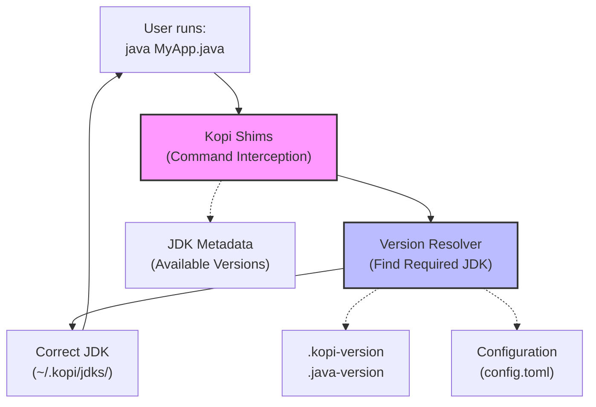
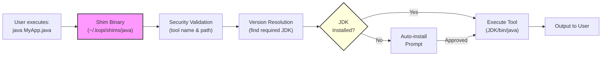
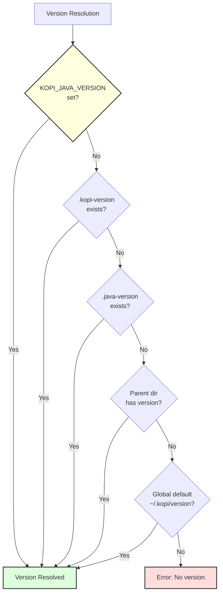
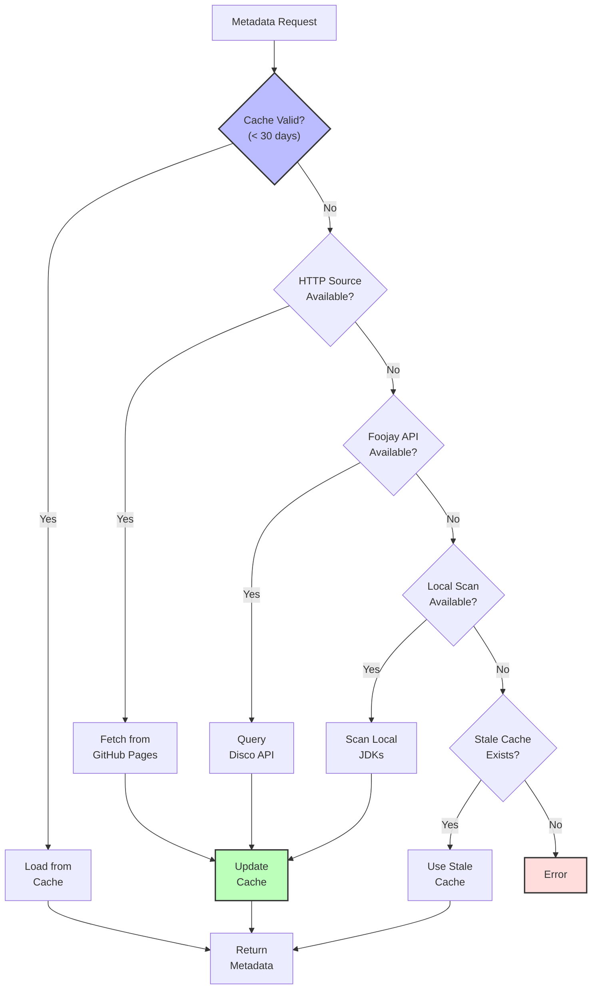
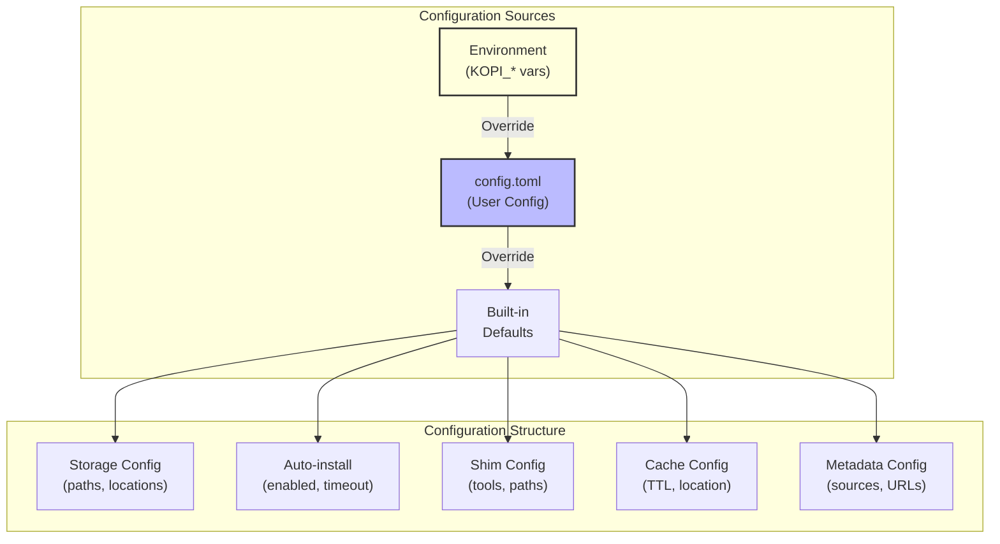

# Architecture

Kopi's internal architecture and core components.

## Overview

Kopi is a Rust-based JDK version manager that intercepts Java commands and automatically manages JDK versions:



Key components:

- **Shims**: Intercept Java commands and route to correct JDK
- **Version Resolver**: Determines which JDK version to use
- **Metadata System**: Tracks available JDK distributions and versions
- **Storage Manager**: Manages installed JDKs in `~/.kopi/jdks/`

## Core Components

### 1. Shim System (`src/shim/`)

Shims are Rust binaries that intercept Java tool invocations:



**Key features:**

- Security validation for tool names and paths
- Auto-installation capability with user prompts
- Platform-specific executable resolution
- Tool discovery and validation
- Minimal overhead through Rust implementation

### 2. Version Resolution (`src/version/resolver.rs`)

Hierarchical version resolution with distribution support:



**Version format support:**

- Simple version: `21` or `17.0.9`
- Distribution-specific: `temurin@21` or `corretto@17`
- Semantic matching: `17` matches `17.0.15`
- File formats: `.kopi-version` (native) and `.java-version` (compatibility)

### 3. Metadata System (`src/metadata/`)

Multi-source metadata provider with intelligent fallback:



**Metadata features:**

- Lazy loading of package details
- Platform-specific filtering
- Distribution-aware caching
- Batch processing capabilities
- 30-day cache TTL with stale fallback

### 4. Configuration System (`src/config.rs`)

Hierarchical configuration with environment overrides:



### 5. Storage Layout

```
~/.kopi/                        # KOPI_HOME
├── shims/                      # Executable shims
│   ├── java                    # Shim for java command
│   ├── javac                   # Shim for javac command
│   └── [other JDK tools]
├── jdks/                       # Installed JDKs
│   ├── temurin-21.0.2/         # Distribution-version format
│   │   └── bin/
│   │       ├── java
│   │       └── javac
│   ├── corretto-17.0.9/
│   └── graalvm-21.0.1/
├── cache/                      # Metadata cache
│   ├── distributions/          # Per-distribution caches
│   │   ├── temurin.json
│   │   └── corretto.json
│   └── metadata.json           # Combined metadata
├── downloads/                  # Temporary download directory
├── version                     # Global default version
└── config.toml                 # User configuration
```

## Next Steps

- [Version Files](version-files.md) - Version configuration
- [Shims](shims.md) - Command interception details
- [Metadata System](metadata.md) - JDK discovery and metadata
- [Caching](caching.md) - Cache management
