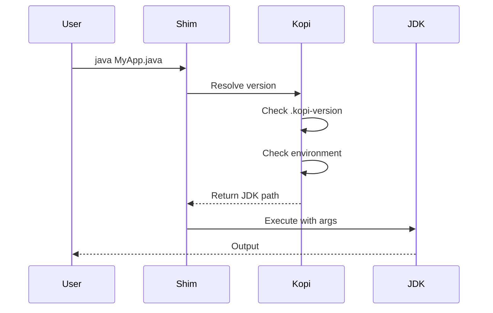
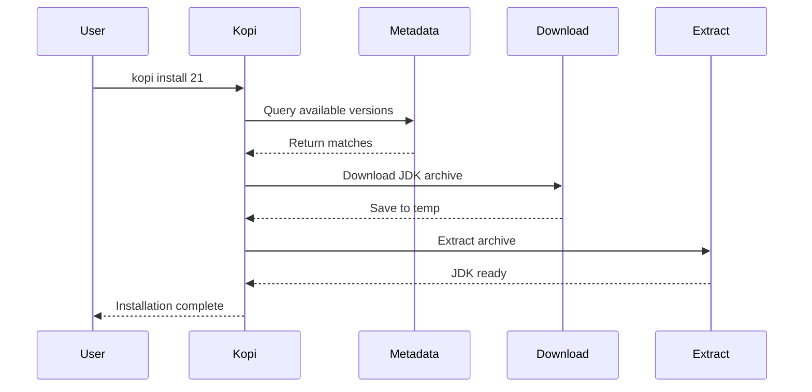

# How Kopi Works

Understanding the architecture and internals of Kopi.

## Architecture Overview

Kopi consists of several key components working together to provide seamless JDK version management:

```
┌─────────────────────────────────────────────────┐
│                   User Shell                     │
└─────────────┬───────────────────────────────────┘
              │
              ▼
┌─────────────────────────────────────────────────┐
│                  Kopi Shims                      │
│         (java, javac, jar, etc.)                 │
└─────────────┬───────────────────────────────────┘
              │
              ▼
┌─────────────────────────────────────────────────┐
│              Kopi Core Engine                    │
│  ┌─────────────┐  ┌──────────────┐             │
│  │   Version   │  │   Metadata   │             │
│  │  Resolution │  │     Cache    │             │
│  └─────────────┘  └──────────────┘             │
└─────────────┬───────────────────────────────────┘
              │
              ▼
┌─────────────────────────────────────────────────┐
│           Installed JDKs                         │
│  ~/.kopi/jdks/temurin-21/                       │
│  ~/.kopi/jdks/corretto-17/                      │
│  ~/.kopi/jdks/graalvm-21/                       │
└─────────────────────────────────────────────────┘
```

## Core Components

### 1. Shims

Shims are lightweight executable scripts that intercept Java commands:

```bash
# When you type:
java --version

# It actually runs:
~/.kopi/shims/java --version

# Which internally:
1. Determines required JDK version
2. Sets up environment
3. Executes: ~/.kopi/jdks/temurin-21/bin/java --version
```

**Key features:**
- Fast execution (< 10ms overhead)
- Transparent to users
- Support all JDK tools (java, javac, jar, etc.)
- Platform-specific optimization

### 2. Version Resolution

Kopi uses a hierarchical resolution strategy:

```
Priority Order:
1. KOPI_VERSION environment variable
2. Shell override (kopi shell)
3. .kopi-version in current directory
4. .java-version in current directory
5. Parent directory version files (recursive)
6. Global default (~/.kopi/config.toml)
7. System JDK
```

**Example resolution:**

```bash
/home/user/
├── .kopi-version (21)              # Inherited by projects/
└── projects/
    ├── project-a/
    │   ├── .kopi-version (17)      # Overrides parent
    │   └── src/
    │       └── Main.java           # Uses JDK 17
    └── project-b/
        └── Main.java                # Uses JDK 21 (inherited)
```

### 3. Metadata System

Kopi uses a multi-source metadata system for JDK discovery:

```
┌──────────────────┐     ┌──────────────────┐
│  Local Metadata  │────▶│  Remote Metadata │
│   (Pre-cached)   │     │   (Foojay API)   │
└──────────────────┘     └──────────────────┘
         │                         │
         └────────┬────────────────┘
                  ▼
         ┌────────────────┐
         │  Merged Cache  │
         │ ~/.kopi/cache/ │
         └────────────────┘
```

**Metadata sources:**
1. **Pre-generated files** - Fast, offline-capable
2. **Foojay API** - Real-time, comprehensive
3. **Local cache** - Combined and optimized

### 4. Storage Layout

```
~/.kopi/
├── shims/                  # Executable shims
│   ├── java
│   ├── javac
│   ├── jar
│   └── ...
├── jdks/                   # Installed JDKs
│   ├── temurin-21.0.2/
│   ├── corretto-17.0.9/
│   └── graalvm-21.0.1/
├── cache/                  # Metadata cache
│   ├── metadata.json
│   └── checksums/
├── downloads/              # Temporary downloads
└── config.toml            # User configuration
```

## Execution Flow

### Command Execution

When you run a Java command:



### Version Installation

When installing a new JDK:



## Performance Optimizations

### 1. Shim Caching

Shims cache version resolution:

```rust
// Pseudo-code
fn resolve_version() -> Version {
    // Check in-memory cache (valid for 1 second)
    if let Some(cached) = CACHE.get() {
        return cached;
    }
    
    // Resolve version
    let version = do_resolution();
    CACHE.set(version, Duration::from_secs(1));
    version
}
```

### 2. Lazy Loading

Metadata is loaded on-demand:

```rust
// Only load what's needed
match command {
    "search" => load_remote_metadata(),
    "current" => load_local_only(),
    _ => skip_metadata(),
}
```

### 3. Parallel Downloads

Large files are downloaded in chunks:

```rust
// Download with multiple connections
async fn download(url: &str) -> Result<()> {
    let chunks = split_into_chunks(url, 4);
    let handles = chunks.map(|chunk| {
        tokio::spawn(download_chunk(chunk))
    });
    
    futures::join_all(handles).await?;
    merge_chunks()
}
```

## Platform Differences

### Unix (Linux/macOS)

- Shims are shell scripts
- Uses symlinks for optimization
- Relies on shebang for execution

### Windows

- Shims are batch files and PowerShell scripts
- Uses junction points
- Handles both Command Prompt and PowerShell

### Platform Detection

```rust
#[cfg(target_os = "macos")]
fn platform_specific() {
    // macOS specific code
}

#[cfg(target_os = "windows")]
fn platform_specific() {
    // Windows specific code
}

#[cfg(target_os = "linux")]
fn platform_specific() {
    // Linux specific code
}
```

## Security Features

### 1. Checksum Verification

All downloads are verified:

```rust
fn verify_download(file: &Path, expected: &str) -> Result<()> {
    let actual = calculate_sha256(file)?;
    if actual != expected {
        return Err("Checksum mismatch");
    }
    Ok(())
}
```

### 2. HTTPS Only

All network requests use HTTPS:

```rust
fn download(url: &str) -> Result<()> {
    if !url.starts_with("https://") {
        return Err("HTTPS required");
    }
    // ... download
}
```

### 3. Path Validation

Prevents directory traversal:

```rust
fn validate_path(path: &Path) -> Result<()> {
    let canonical = path.canonicalize()?;
    if !canonical.starts_with(KOPI_HOME) {
        return Err("Invalid path");
    }
    Ok(())
}
```

## Error Handling

Kopi uses structured error handling:

```rust
#[derive(Error, Debug)]
enum KopiError {
    #[error("JDK not found: {0}")]
    JdkNotFound(String),
    
    #[error("Network error: {0}")]
    Network(#[from] attohttpc::Error),
    
    #[error("IO error: {0}")]
    Io(#[from] std::io::Error),
}
```

Errors provide helpful context:

```
Error: JDK not found: temurin@25

Suggestion: Run 'kopi search 25' to see available versions
```

## Comparison with Other Tools

### vs. Environment Variables

Traditional approach:
```bash
export JAVA_HOME=/usr/lib/jvm/java-17
export PATH=$JAVA_HOME/bin:$PATH
```

Problems:
- Manual switching
- No project isolation
- Complex scripts needed

Kopi approach:
```bash
# Automatic, project-aware, zero configuration
cd my-project && java --version
```

### vs. Update Alternatives

System approach:
```bash
sudo update-alternatives --config java
```

Problems:
- Requires sudo
- System-wide changes
- Limited to system packages

Kopi approach:
```bash
# User-space, project-specific, any JDK version
kopi use 21
```

## Next Steps

- [Version Files](version-files.md) - Configuration files
- [Shims](shims.md) - Deep dive into shims
- [Metadata System](metadata.md) - Metadata architecture
- [Caching](caching.md) - Cache management