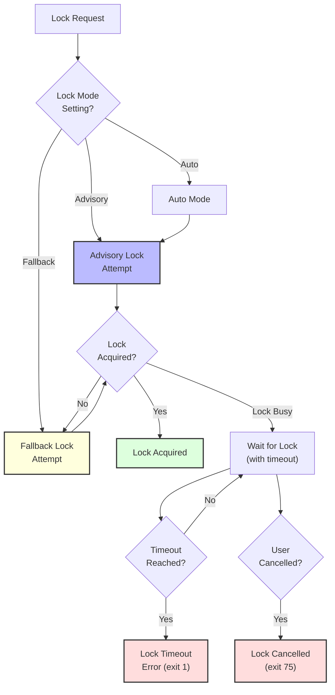
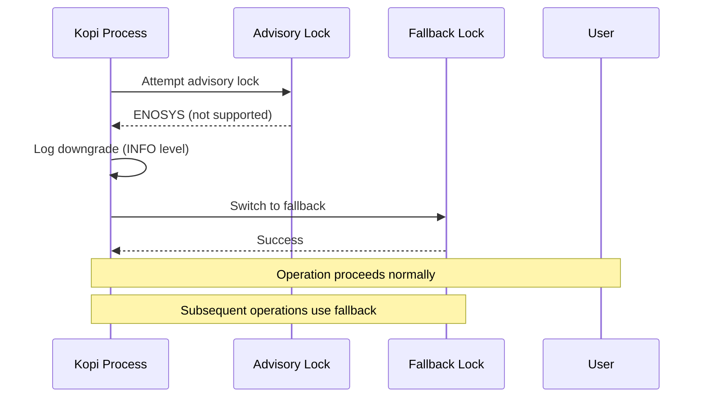
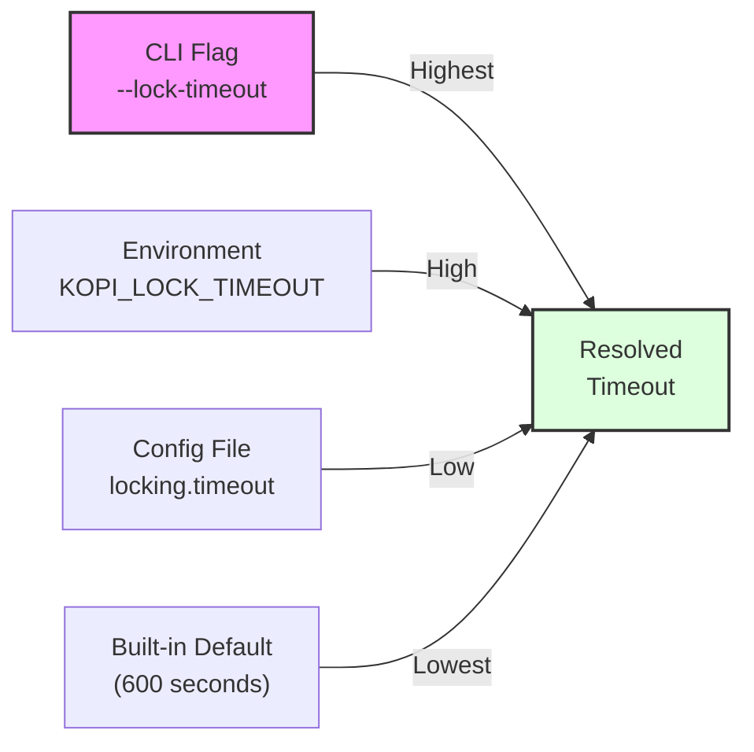
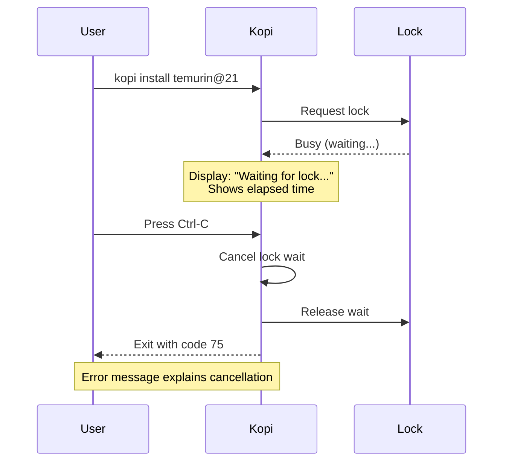
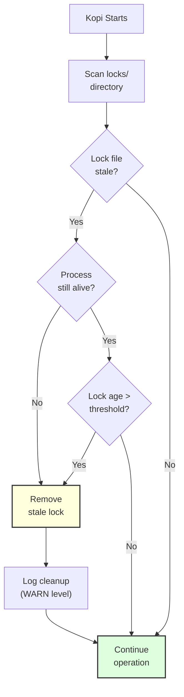
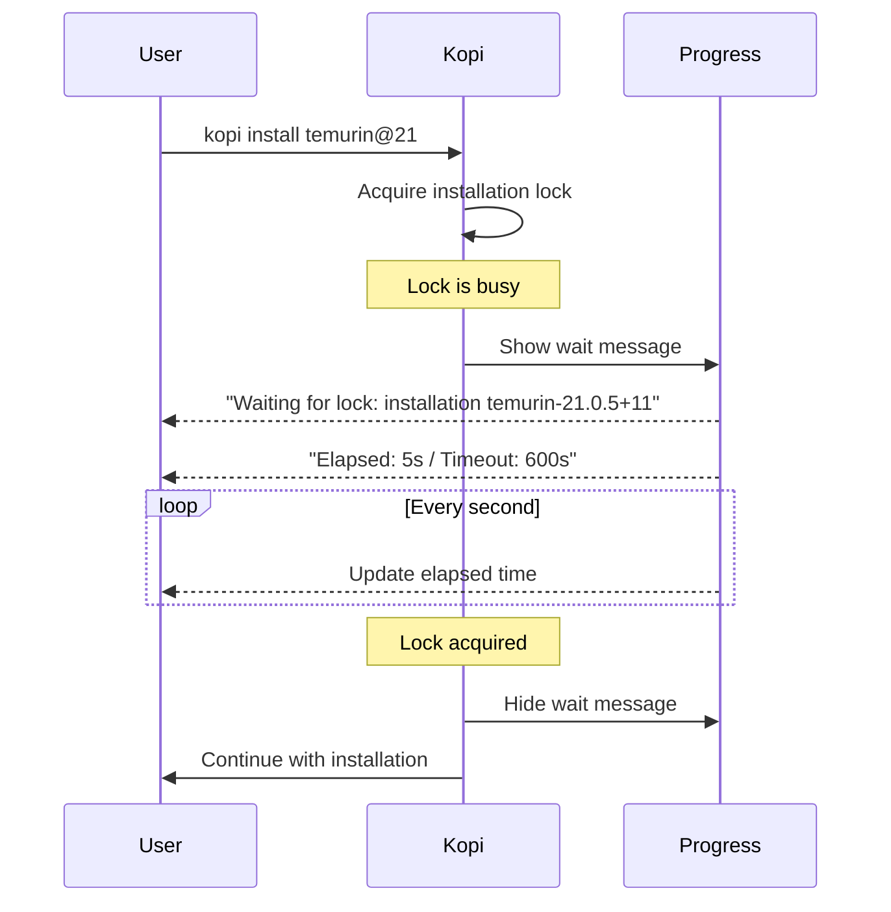

# Locking System

Understanding how Kopi coordinates concurrent operations to ensure safe and reliable JDK management.

## What is the Locking System?

Kopi's locking system prevents concurrent operations from interfering with each other. When multiple processes try to install, uninstall, or modify JDKs simultaneously, locks ensure operations complete safely without corruption or conflicts.

The locking system operates transparently in the background, requiring no manual intervention under normal circumstances. Users only notice it when waiting for another operation to complete.

## Why Locking Matters

Without proper locking, concurrent operations could cause several problems:

- **Corrupted installations**: Two processes extracting the same JDK simultaneously could create incomplete or corrupted files
- **Metadata inconsistency**: Simultaneous cache updates could produce invalid metadata files
- **Race conditions**: One process uninstalling while another uses the same JDK could cause failures
- **Resource conflicts**: Multiple downloads competing for disk space could exceed available capacity

Kopi's locking system prevents all these scenarios by coordinating access to shared resources.

## Lock Strategies

Kopi implements two complementary locking strategies, automatically selecting the best available option for your platform:



### Advisory Locks

Advisory locks use operating system primitives for efficient lock coordination:

- **Unix/Linux/macOS**: fcntl-based file locking
- **Windows**: File lock APIs
- **Performance**: Zero disk overhead, immediate acquisition when available
- **Reliability**: Released automatically when process terminates

Advisory locks are the preferred mechanism because they leverage kernel-level coordination with automatic cleanup on process termination. The operating system guarantees that locks are released even if a process crashes unexpectedly.

### Fallback Locks

When advisory locks are unavailable or fail, Kopi automatically downgrades to fallback locks:

- **Implementation**: Atomic file creation using create_new semantics
- **Portability**: Works on all platforms and filesystems
- **Trade-off**: Requires explicit hygiene to clean up stale locks

Fallback locks create marker files in the locks directory. The atomic create_new operation ensures only one process can create the marker file, providing mutual exclusion. If a process crashes while holding a fallback lock, the marker file remains until cleaned up by lock hygiene.

### Automatic Downgrade

Kopi intelligently downgrades from advisory to fallback locks when necessary:



Common scenarios triggering downgrade:

- Network filesystems that don't support advisory locks (NFS, SMB)
- Container environments with limited system call support
- Platforms lacking native locking primitives
- Filesystem-specific limitations

The downgrade happens automatically and is logged at INFO level for observability. Users experience no difference in functionality, only a slightly different lock implementation.

## Lock Timeout Configuration

Lock timeout determines how long Kopi waits to acquire a lock before giving up. The timeout value is resolved through a precedence chain:



### Precedence Order (Highest to Lowest)

1. **CLI flag**: `kopi --lock-timeout 30 install temurin@21`
2. **Environment variable**: `export KOPI_LOCK_TIMEOUT=120`
3. **Configuration file**: `locking.timeout = 300` in `~/.kopi/config.toml`
4. **Built-in default**: 600 seconds (10 minutes)

### Timeout Values

The timeout accepts two types of values:

- **Seconds**: Any positive integer (e.g., `30`, `600`, `3600`)
- **Infinite**: The literal string `infinite` to wait indefinitely

Examples:

```bash
# Wait up to 30 seconds for install lock
kopi --lock-timeout 30 install temurin@21

# Wait indefinitely for cache refresh
kopi --lock-timeout infinite cache refresh

# Set default timeout via environment
export KOPI_LOCK_TIMEOUT=120
kopi install corretto@17

# Configure in config.toml
# locking.timeout = 300
```

### Timeout Error Reporting

When a lock acquisition times out, Kopi provides detailed information:

- The operation that was blocked
- The elapsed wait time
- The configured timeout value
- Where the timeout was configured (CLI, environment, config file, or default)
- Suggestions for adjusting the timeout

This transparency helps users understand why operations failed and how to adjust settings for their workflow.

## Lock Cancellation

Users can cancel lock acquisition by pressing Ctrl-C during the wait period. Kopi handles cancellation gracefully:



**Exit Code 75**: Lock wait cancelled by user

This distinct exit code allows scripts and automation to differentiate between:

- User-initiated cancellation (exit 75) - intentional interruption
- Lock timeout (exit 1) - operation exceeded configured timeout
- Other errors - different exit codes based on error type

The cancellation feature ensures users aren't trapped waiting for locks when they need to interrupt operations.

## Lock Hygiene

Lock hygiene automatically cleans up stale lock files that weren't properly released. This cleanup process runs during Kopi startup:



**When hygiene removes locks:**

- Lock file age exceeds the stale threshold derived from the configured timeout
- Associated marker or staging files are considered stale by the same threshold
- Lock file or marker metadata cannot be read (treated as stale)

**What hygiene doesn't affect:**

- Active locks held by running processes
- Recently created locks (within threshold)
- Advisory locks (automatically released by OS)

**Hygiene behavior:**

- Runs automatically on every Kopi invocation
- Emits a debug summary of removals and logs warnings only when cleanup encounters errors
- Never fails the CLI operation (cleanup is best-effort)
- Ensures long-running systems don't accumulate stale locks

Users typically never need to think about lock hygiene. It operates silently in the background, preventing lock files from accumulating over time.

## Lock Scopes

Kopi uses different lock scopes to coordinate specific types of operations:

### Installation Locks

Each JDK installation is protected by a scope-specific lock:

- **Scope identifier**: `installation temurin-21.0.5+11`
- **Purpose**: Prevent concurrent installation or uninstallation of the same JDK
- **Duration**: Held during download, extraction, and verification
- **Allows**: Multiple JDKs can install concurrently (different versions)

Example scenario: Two processes can install `temurin@21` and `corretto@17` simultaneously because they use different installation locks. However, two processes cannot install `temurin@21` at the same time.

### Cache Writer Lock

The cache writer lock serializes metadata cache updates:

- **Scope identifier**: `cache writer`
- **Purpose**: Prevent cache corruption from concurrent writes
- **Duration**: Held during metadata fetch and cache file write
- **Allows**: Multiple readers can access cache while writer waits

Example scenario: Running `kopi cache refresh` blocks other cache refresh operations but doesn't prevent `kopi install` from reading the existing cache.

### Global Config Lock

The global config lock protects configuration file updates:

- **Scope identifier**: `global configuration`
- **Purpose**: Prevent concurrent updates to global configuration
- **Duration**: Held during configuration file write operations
- **Allows**: Multiple readers can access configuration while writer waits

Example scenario: Running `kopi global 21` blocks other global configuration updates (like another `kopi global` command) but doesn't prevent other operations from reading the current configuration.

## Lock Wait Feedback

When Kopi waits for a lock, it provides feedback about the wait:



**Feedback elements:**

- Lock scope being waited for (installation, cache writer, etc.)
- Elapsed wait time
- Configured timeout value
- Timeout source (CLI flag, environment, config, default)
- Cancellation instructions (Ctrl-C to cancel)

**Progress modes:**

- **Interactive terminal**: Spinners or progress indicators with live updates
- **Non-interactive**: Simple textual updates at intervals
- **--no-progress flag**: Suppresses wait feedback entirely

The feedback system ensures users understand what's happening during lock waits and can make informed decisions about cancelling or waiting longer.

## Configuration

Configure locking behavior in `~/.kopi/config.toml`:

```toml
[locking]
# Lock acquisition strategy
# Options: "auto" (default), "advisory", "fallback"
mode = "auto"

# Lock acquisition timeout
# Accepts seconds (e.g., 600) or "infinite"
timeout = 600
```

**Mode options:**

- `auto`: Attempt advisory locks first, fall back automatically (recommended)
- `advisory`: Use only advisory locks, fail if unavailable
- `fallback`: Use only fallback locks (for testing or specific filesystems)

**Environment variable overrides:**

```bash
# Override timeout for a single command
KOPI_LOCK_TIMEOUT=120 kopi install temurin@21

# Override mode (rarely needed)
KOPI_LOCKING__MODE=fallback kopi cache refresh
```

## Performance Characteristics

The locking system is designed for minimal overhead:

- **Advisory lock acquisition**: < 1ms when lock is available
- **Fallback lock acquisition**: < 10ms when lock is available
- **Lock wait checking**: < 100ms per retry interval
- **Hygiene scan**: < 50ms for typical lock directory sizes
- **Memory overhead**: < 1KB per acquired lock

Lock operations are asynchronous when possible, allowing progress indicators and user input to remain responsive during waits.

## Troubleshooting

### Lock Timeout Issues

If operations frequently time out waiting for locks:

1. **Identify the bottleneck**: Check which lock scope is timing out
2. **Increase timeout**: Use `--lock-timeout` flag or configuration
3. **Check for stuck processes**: Look for abandoned Kopi processes
4. **Run lock hygiene**: Start Kopi to trigger automatic cleanup

### Stale Lock Files

If you suspect stale locks are causing delays:

1. **Automatic cleanup**: Simply run any Kopi command (hygiene runs on startup)
2. **Manual cleanup**: Remove files from `~/.kopi/locks/` (when no Kopi processes are running)
3. **Check logs**: Enable verbose logging with `-v` flag to see hygiene actions

### Network Filesystem Issues

When using Kopi on network filesystems (NFS, SMB):

1. **Advisory lock failures**: Automatic downgrade to fallback locks
2. **Slower lock operations**: Network latency affects lock acquisition
3. **Stale lock accumulation**: More frequent hygiene may be needed
4. **Recommendation**: Use local storage for `KOPI_HOME` when possible

## Next Steps

- [Commands Reference](../reference/commands.md) - Using `--lock-timeout` flag
- [Configuration](../reference/configuration.md) - Locking configuration options
- [Environment Variables](../reference/environment.md) - `KOPI_LOCK_TIMEOUT` and overrides
- [Exit Codes](../reference/exit-codes.md) - Lock-related exit codes
