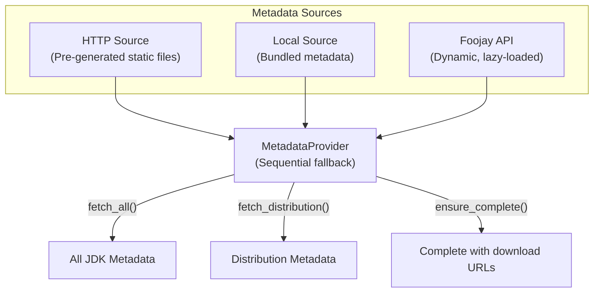

# Metadata System

Understanding how Kopi discovers and manages JDK information.

## Overview

Kopi's metadata system provides comprehensive information about available JDK distributions, versions, and download locations. It uses a provider-based architecture with multiple sources that are tried sequentially, ensuring fallback support when sources are unavailable.

## Architecture

## Metadata Sources

Kopi uses three types of metadata sources, each implementing the MetadataSource trait:

### HTTP Source (HttpMetadataSource)

The HTTP source fetches pre-generated metadata from static web servers, with kopi-vm.github.io as the default. This source provides platform-specific metadata files organized by operating system, architecture, and libc type. It uses an index file to discover available metadata files and automatically filters metadata based on the current platform. All metadata includes complete download URLs and checksums.

**Advantages:**

- Fast access through CDN hosting
- Offline capability once cached
- No API rate limits
- Pre-validated and complete data

### Local Directory Source (LocalDirectorySource)

The local directory source reads metadata from a local directory structure, typically bundled with Kopi installation or extracted from archives. It follows the same platform-specific directory structure as the HTTP source and serves as the primary fallback when network sources are unavailable. All metadata contains the required fields for installation.

**Advantages:**

- Always available without network requirements
- Fast local filesystem access
- Customizable for enterprise environments
- No external dependencies

### Foojay API Source (FoojayMetadataSource)

The Foojay API source provides dynamic metadata from the Foojay Discovery API at disco.foojay.io. It uses lazy loading, fetching minimal data initially and loading download URLs and checksums on-demand. This source offers the most comprehensive and up-to-date JDK information.

**Advantages:**

- Always current with latest releases
- Comprehensive JDK coverage
- Official API from the Java community
- New distributions immediately available

## Metadata Structure

### Core JdkMetadata

The primary metadata structure used throughout Kopi contains:

- **Identification fields**: Unique package identifier, distribution name (temurin, corretto, etc.), Java version, and distribution-specific version
- **Platform information**: Architecture (x64, aarch64, etc.), operating system (Linux, macOS, Windows), package type (JDK, JRE), and archive type (tar.gz, zip, etc.)
- **Lazy-loaded fields**: Download URL, file checksum, and checksum type (SHA256, MD5, etc.) - these may be absent for Foojay source initially
- **Additional metadata**: File size in bytes, libc type (glibc, musl, etc.), JavaFX bundled flag, term of support (LTS, MTS, STS), release status (GA, EA, etc.), and latest build availability

### Index Structure

The index structure used by HTTP and Local sources for metadata discovery includes:

- **Index file**: Contains format version, last update timestamp, list of available metadata files, and optional generator configuration
- **Index file entries**: Each entry specifies the file path relative to base, distribution name, supported architectures, operating systems, and libc types, plus file size, checksum, and last modified timestamp

## Provider Architecture

### Sequential Fallback Pattern

The MetadataProvider manages multiple sources with automatic fallback. When fetching metadata, it iterates through configured sources in order. For each source, it checks availability first, then attempts to fetch metadata. If a source succeeds, it returns the metadata immediately. If a source fails, it logs the error and tries the next source. If all sources fail, it returns an aggregated error message.

### Lazy Loading Pattern

For the Foojay API source, metadata is loaded in two phases:

1. **Initial fetch**: Returns metadata without download URLs, containing basic package information
2. **Completion on demand**: When installation is requested, loads download URLs and checksums

The provider's ensure_complete method checks if metadata has required fields. If download URL is missing, it fetches package details from the source and updates the metadata with download URL, checksum, and checksum type.

### Platform Filtering

Metadata is automatically filtered for the current platform. The filtering process:

- Detects current architecture, operating system, and libc type
- Filters index entries based on platform compatibility
- Returns only metadata files relevant to the current system
- Handles platform-specific naming conventions

## Configuration

### Source Configuration

Metadata sources are configured in the Kopi configuration file using TOML format. The configuration includes:

**Cache settings**:

- Maximum age in hours for cached metadata
- Automatic refresh flag for expired cache

**Source definitions** (processed in order):

- HTTP sources with base URL, local caching, and timeout settings
- Local sources with directory path, archive pattern, and extraction caching
- Foojay API source with base URL and timeout (disabled by default due to rate limits)

Each source has a type (http, local, or foojay), unique name, enabled flag, and source-specific settings.

### Source Priority

Sources are tried in the order they appear in configuration:

1. First enabled source is attempted
2. If it fails or is unavailable, the next source is tried
3. Process continues until success or all sources are exhausted
4. This ensures reliable fallback behavior

## Metadata Files Organization

### Pre-generated Metadata Structure

The pre-generated metadata hosted at kopi-vm.github.io/metadata follows this structure:

- **index.json**: Master index file listing all available metadata
- **Platform directories**: Named using the pattern os-arch-libc
- **Distribution files**: JSON files for each JDK distribution within platform directories

Platform directories contain metadata for specific OS, architecture, and libc combinations, such as linux-x64-glibc, macos-aarch64-libc, or windows-x64-c_std_lib.

### Platform Directory Naming

Platform directories follow the pattern of operating system, architecture, and libc type separated by hyphens:

- **Linux**: Uses actual libc type (glibc, musl)
- **macOS**: Always uses 'libc' as a placeholder
- **Windows**: Always uses 'c_std_lib' as a placeholder
- **Other platforms**: Follow platform-specific conventions

### Local Bundled Structure

Bundled metadata in the local Kopi installation follows the same structure as pre-generated metadata, with an index.json file at the root and platform-specific directories containing distribution JSON files.

## Source Health Monitoring

Kopi monitors the health of configured sources through the check_sources_health method. For each configured source, it checks availability and returns a health status map indicating whether each source is available or unavailable with error details.

### Availability Checking

Each source implements its own availability checking:

- **HTTP Source**: Attempts to fetch the index.json file
- **Local Source**: Checks if the directory and index file exist
- **Foojay Source**: Pings the API endpoint to verify connectivity

### Automatic Fallback

When a source fails during metadata fetching:

1. The error is logged with detailed information
2. The next configured source is automatically tried
3. The process continues until one source succeeds
4. If all sources fail, all failure messages are aggregated in the final error

## Metadata Generation

Kopi includes a metadata generator for creating pre-generated metadata files.

### Generator Configuration

The generator configuration includes:

- List of distributions to include (temurin, corretto, graalvm, etc.)
- Java major versions to include (8, 11, 17, 21, etc.)
- Flag to include early access builds
- Flag to include only LTS versions
- Maximum number of builds per version

### Generation Process

The metadata generation follows these steps:

1. Fetches metadata from Foojay API for all configured distributions
2. Organizes metadata by platform (OS-architecture-libc combinations)
3. Creates index.json with file listings and metadata
4. Generates platform-specific JSON files for each distribution
5. Updates automatically via GitHub Actions daily

### Platform Detection

The generator automatically detects platform combinations by analyzing the metadata from Foojay API, identifying unique combinations of operating system, architecture, and libc type, and creating appropriate directory structures.

## Batch Operations

Kopi supports efficient batch operations for metadata processing.

### Batch Completion

The ensure_complete_batch method processes multiple metadata entries efficiently, iterating through the list and ensuring each entry has complete download information. This is particularly useful when preparing multiple JDKs for installation.

### Optimizations

The metadata system employs several optimizations:

- Platform filtering reduces data transfer by fetching only relevant metadata
- Index-based discovery minimizes API calls through efficient file lookup
- Lazy loading defers expensive operations until needed
- Sequential fallback ensures reliability through multiple source options

## Custom Metadata Sources

### Enterprise Configuration

Organizations can configure custom metadata sources for internal JDK distributions. Custom HTTP sources can point to internal servers hosting metadata in the same format as the public sources. Local directory sources can reference shared network locations or extracted archives. Multiple custom sources can be configured with different priorities.

### Creating Custom Metadata

To create custom metadata, use the metadata generator tool (kopi-metadata-gen) with specific parameters:

- Specify distributions to include
- Select major versions to generate
- Choose output directory for generated files

The generator creates an index.json file, platform-specific directories, and distribution JSON files following the standard format.

## Next Steps

- [Architecture](architecture.md) - Understand the system overview
- [Configuration](../reference/configuration.md) - Configure metadata sources
