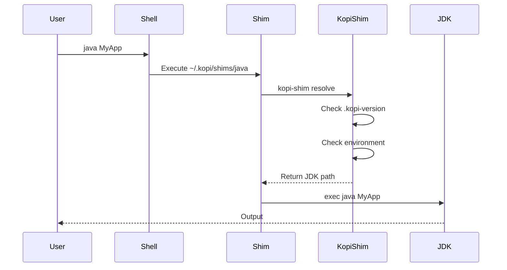

# Shims

Understanding how Kopi's shim system enables transparent JDK version management.

## What are Shims?

Shims are lightweight executable scripts that act as proxies between your shell and the actual JDK binaries. When you run a Java command, you're actually running a Kopi shim that:

1. Determines which JDK version to use
2. Sets up the environment
3. Executes the real JDK binary

```
User Input:          java MyApp.java
     ↓
Kopi Shim:          ~/.kopi/shims/java
     ↓
Version Resolution:  Check .kopi-version, environment, etc.
     ↓
Real Binary:        ~/.kopi/jdks/temurin-21/bin/java MyApp.java
```

## How Shims Work

### Unix/Linux/macOS

On Unix-like systems, shims are shell scripts:

```bash
#!/usr/bin/env bash
# ~/.kopi/shims/java

# Resolve JDK version
JDK_PATH=$(kopi-shim resolve java)

# Execute real binary
exec "$JDK_PATH/bin/java" "$@"
```

### Windows

On Windows, shims are batch files and PowerShell scripts:

```batch
@echo off
REM ~/.kopi/shims/java.bat

REM Resolve JDK version
for /f "delims=" %%i in ('kopi-shim resolve java') do set JDK_PATH=%%i

REM Execute real binary
"%JDK_PATH%\bin\java.exe" %*
```

## Shim Components

### 1. Shim Scripts

Located in `~/.kopi/shims/`, one for each JDK tool:

```
~/.kopi/shims/
├── java           # Java runtime
├── javac          # Java compiler
├── jar            # Archive tool
├── javadoc        # Documentation generator
├── jshell         # Interactive shell
├── jlink          # Module linker
├── jdeps          # Dependency analyzer
├── keytool        # Key management
└── ...           # 30+ other tools
```

### 2. Shim Binary (kopi-shim)

The core shim engine written in Rust for performance:

```rust
// Simplified kopi-shim logic
fn main() {
    let tool = get_tool_name();
    let version = resolve_version();
    let jdk_path = get_jdk_path(version);
    let tool_path = format!("{}/bin/{}", jdk_path, tool);

    exec(tool_path, args);
}
```

### 3. PATH Integration

Shims directory added to PATH:

```bash
# In ~/.bashrc or ~/.zshrc
export PATH="$HOME/.kopi/shims:$PATH"

# Shims take precedence over system Java
which java
# Output: /home/user/.kopi/shims/java
```

## Shim Lifecycle

### Installation

When you install Kopi:


### Execution Flow

When you run a Java command:



## Performance Optimization

### 1. Native Binary

The `kopi-shim` binary is written in Rust for speed:

```rust
// Fast version resolution
#[inline(always)]
fn resolve_version() -> String {
    // Check cache first (< 1ms)
    if let Some(cached) = check_cache() {
        return cached;
    }

    // Full resolution (< 10ms)
    full_resolution()
}
```

### 2. Caching

Recent resolutions are cached:

```rust
struct Cache {
    version: String,
    timestamp: Instant,
    ttl: Duration,
}

impl Cache {
    fn is_valid(&self) -> bool {
        self.timestamp.elapsed() < self.ttl
    }
}
```

### 3. Lazy Loading

Only load what's needed:

```rust
// Don't load metadata for simple execution
if command == "exec" {
    return exec_without_metadata();
}
```

## Supported Tools

### Core Java Tools

```bash
# Compiler and runtime
java          # Java application launcher
javac         # Java compiler
javap         # Class file disassembler
javah         # C header generator (deprecated)

# Packaging and deployment
jar           # Archive tool
jarsigner     # JAR signing tool
pack200       # JAR compression (deprecated)
unpack200     # JAR decompression (deprecated)

# Development tools
jshell        # Interactive Java shell
jconsole      # Monitoring console
jdb           # Debugger
jdeps         # Dependency analyzer
```

### Documentation Tools

```bash
javadoc       # API documentation generator
```

### Security Tools

```bash
keytool       # Key and certificate management
jarsigner     # JAR signing and verification
policytool    # Policy file creation (deprecated)
```

### Performance Tools

```bash
jps           # Java process status
jstat         # Statistics monitoring
jstack        # Stack traces
jmap          # Memory map
jhat          # Heap analyzer (deprecated)
jinfo         # Configuration info
```

### Module System Tools

```bash
jlink         # Custom runtime image creator
jmod          # JMOD file creator
jimage        # JIMAGE file inspector
```

### Distribution-Specific Tools

Some distributions include additional tools:

```bash
# GraalVM
native-image  # Native compilation
gu            # GraalVM updater

# OpenJ9 (Semeru)
jitserver     # JIT compilation server

# Corretto
jmc           # Mission Control
```

## Shim Management

### Listing Shims

```bash
# List all shims
ls ~/.kopi/shims/

# Check shim version
~/.kopi/shims/java --version

# Verify shim installation
kopi doctor --check shims
```

### Updating Shims

```bash
# Regenerate all shims
kopi setup --regenerate-shims

# Update specific shim
kopi setup --shim java
```

### Custom Shims

Create custom shims for specific needs:

```bash
#!/usr/bin/env bash
# ~/.kopi/shims/custom-java

# Custom logic before execution
export CUSTOM_VAR=value

# Call standard shim
exec ~/.kopi/shims/java "$@"
```

## Platform-Specific Details

### macOS

- Uses `/usr/bin/env bash` for portability
- Supports both Intel and Apple Silicon
- Handles `.app` bundle structure

### Linux

- Compatible with all major distributions
- Supports both glibc and musl
- Works in containers

### Windows

- Dual shim system (batch + PowerShell)
- Handles path separators
- Supports both CMD and PowerShell

## Troubleshooting

### Shims Not Working

```bash
# Check PATH order
echo $PATH
# Ensure ~/.kopi/shims comes first

# Verify shim exists
ls -la ~/.kopi/shims/java

# Test shim directly
~/.kopi/shims/java --version

# Regenerate shims
kopi setup --regenerate-shims
```

### Performance Issues

```bash
# Measure shim overhead
time ~/.kopi/shims/java --version

# Check cache
kopi cache status

# Profile execution
RUST_LOG=debug java --version
```

### Command Not Found

```bash
# Rehash (Zsh)
rehash

# Update PATH
export PATH="$HOME/.kopi/shims:$PATH"

# Verify installation
kopi doctor
```

## Advanced Usage

### Environment Variables

Control shim behavior:

```bash
# Force specific version
KOPI_JAVA_VERSION=21 java --version

# Debug with Rust logging
RUST_LOG=debug java MyApp
```

### Direct Binary Access

Bypass shims when needed:

```bash
# Direct JDK access
~/.kopi/jdks/temurin-21/bin/java --version

# Alias for direct access
alias java-direct='~/.kopi/jdks/temurin-21/bin/java'
```

### Shim Hooks

Add pre/post execution hooks:

```bash
# ~/.kopi/hooks/pre-java
#!/bin/bash
echo "Starting Java with version $(kopi current)"

# ~/.kopi/hooks/post-java
#!/bin/bash
echo "Java execution completed"
```

## Security Considerations

### Shim Integrity

Shims are protected from modification:

```bash
# Check shim checksums
kopi verify --shims

# Permissions (Unix)
ls -la ~/.kopi/shims/java
# -rwxr-xr-x (755)
```

### Path Injection Prevention

Shims validate paths:

```rust
fn validate_jdk_path(path: &Path) -> Result<()> {
    // Ensure path is within KOPI_HOME
    let canonical = path.canonicalize()?;
    if !canonical.starts_with(KOPI_HOME) {
        return Err("Invalid JDK path");
    }
    Ok(())
}
```

## Comparison with Other Approaches

### vs. Symlinks

Traditional symlink approach:

```bash
ln -s /usr/lib/jvm/java-17/bin/java /usr/local/bin/java
```

Problems:

- Single version only
- Manual management
- No project awareness

Kopi shims:

- Multiple versions
- Automatic switching
- Project-specific

### vs. Shell Functions

Shell function approach:

```bash
function java() {
    /path/to/specific/java "$@"
}
```

Problems:

- Shell-specific
- Not inherited by subprocesses
- Complex management

Kopi shims:

- Work in any shell
- Inherited by all processes
- Simple management

## Next Steps

- [Metadata System](metadata.md) - JDK discovery
- [Caching](caching.md) - Performance optimization
- [Shell Integration](../guide/shell-integration.md) - Shell setup
