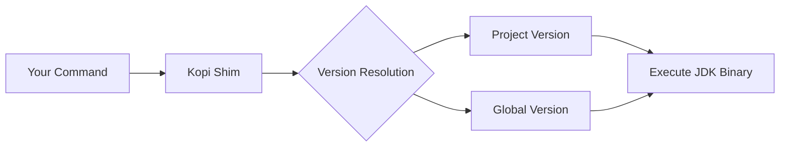

# Kopi - JDK Version Manager

Fast, reliable JDK version management for modern development teams.

## What is Kopi?

Kopi is a JDK version manager written in Rust that makes it easy to install, manage, and switch between different Java Development Kit versions. It provides seamless integration with your shell, automatic version switching based on project configuration, and support for all major JDK distributions.

## Key Features

<div class="grid cards" markdown>

- :rocket: **Fast Performance**  
  Built with Rust for minimal overhead and instant JDK switching

- :arrows_counterclockwise: **Automatic Switching**  
  Detects and switches JDK versions based on project configuration

- :package: **Multiple Distributions**  
  Support for Temurin, Corretto, Zulu, GraalVM, and more

- :shield: **Shell Integration**  
  Transparent version management through shims

- :pushpin: **Project Pinning**  
  Lock JDK versions per project with version files

- :globe_with_meridians: **Cross-Platform**  
  Works on macOS, Linux, and Windows

</div>

## Quick Start

### Installation

=== "macOS"

    ```bash
    brew install kopi-vm/tap/kopi
    ```

=== "Linux"

    ```bash
    curl -fsSL https://kopi-vm.github.io/install.sh | bash
    ```

=== "Windows"

    ```bash
    winget install kopi
    ```

### Basic Usage

```bash
# Install JDK 21
kopi install 21

# Use JDK 21 globally
kopi use 21

# Pin JDK 17 for current project
kopi pin 17

# List installed JDKs
kopi list
```

## How It Works



When you run a Java command, Kopi:

1. **Intercepts** the command through shims
2. **Resolves** the appropriate JDK version
3. **Executes** the correct JDK binary

## Why Choose Kopi?

### vs Manual Management

- **No more JAVA_HOME juggling** - Kopi handles environment variables automatically
- **Project isolation** - Each project can use its own JDK version
- **Team consistency** - Share version files to ensure everyone uses the same JDK

### vs Other Version Managers

| Feature | Kopi | SDKMAN! | jEnv |
|---------|------|---------|------|
| Performance | ⚡ Very Fast | 🐢 Moderate | 🐌 Slow |
| Written in | Rust | Bash | Bash |
| Windows Support | ✅ Native | ⚠️ WSL only | ❌ No |
| Offline Mode | ✅ Yes | ❌ No | ✅ Yes |

## Supported JDK Distributions

<div class="grid" markdown>

:material-coffee: **Eclipse Temurin**  
High-quality, TCK-tested builds from the Eclipse Foundation

:simple-amazonaws: **Amazon Corretto**  
Production-ready builds with long-term support from AWS

:material-microsoft-azure: **Microsoft OpenJDK**  
Optimized for Azure and cloud deployments

:material-language-java: **GraalVM**  
High-performance JDK with native compilation support

:material-server: **IBM Semeru**  
OpenJ9-based JVM with superior memory efficiency

:material-package-variant: **Azul Zulu**  
Certified OpenJDK builds for enterprise applications

</div>

[View all supported distributions →](reference/distributions.md)

## Getting Started

<div class="grid cards" markdown>

- :material-download: **[Installation](getting-started/installation.md)**  
  Get Kopi installed on your system

- :material-rocket-launch: **[Quick Start](getting-started/quickstart.md)**  
  Learn the basics in 5 minutes

- :material-book-open-variant: **[User Guide](guide/managing-versions.md)**  
  Comprehensive guide to all features

- :material-api: **[Command Reference](reference/commands.md)**  
  Complete list of commands and options

</div>

## Example Workflow

```bash
# Clone a project
git clone https://github.com/example/project.git
cd project

# Kopi automatically detects .kopi-version file
cat .kopi-version
# temurin@21

# Install the required JDK (if not already installed)
kopi install $(cat .kopi-version)

# Java commands now use the correct version
java --version
# openjdk 21.0.2 2024-01-16 LTS

# Run your project
./gradlew build
```

## Join the Community

- :material-github: **[GitHub Repository](https://github.com/kopi-vm/kopi)**  
  Star the project and contribute

- :material-bug: **[Report Issues](https://github.com/kopi-vm/kopi/issues)**  
  Found a bug? Let us know

- :material-forum: **[Discussions](https://github.com/kopi-vm/kopi/discussions)**  
  Ask questions and share ideas

## Latest Updates

Stay informed about new releases and features:

- Follow the [GitHub releases](https://github.com/kopi-vm/kopi/releases)
- Check the [changelog](https://github.com/kopi-vm/kopi/blob/main/CHANGELOG.md)
- Read the [blog](https://kopi-vm.github.io/blog)

---

<div style="text-align: center" markdown>
Made with :heart: by the Kopi community  
Licensed under [Apache 2.0](https://github.com/kopi-vm/kopi/blob/main/LICENSE)
</div>
